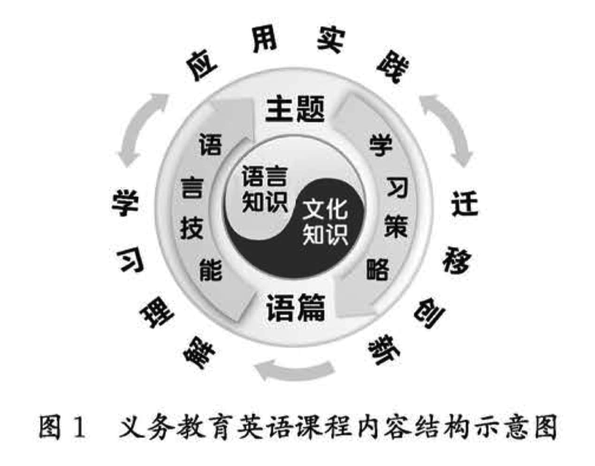

# 四、课程内容

英语课程内容由主题、语篇、语言知识、文化知识、语言技能和学习策略等要素构成。围绕这些要素，通过学习理解、应用实践、迁移创新等活动，推动学生核心素养在义务教育全程中持续发展（见图1）。

课程内容的六个要素是一个相互关联的有机整体，共同构成核心素养发展的内容基础。其中，主题具有联结和统领其他内容要素的作用，为语言学习和课程育人提供语境范畴；语篇承载表达主题的语言知识和文化知识，为学生提供多样化的文体素材；语言知识为语篇的构成和意义的表达提供语言要素；文化知识为学生奠定人文底蕴、培养科学精神、形成良好品格和正确价值观提供内容资源；语言技能为学生获取信息、建构知识、表达思想、交流情感提供途径；学习策略为学生提高学习效率、提升学习效果提供具体方式方法。

义务教育英语课程内容分三级呈现，建议3～4年级学习一级内容，5～6年级学习二级内容，7～9年级学习三级内容；兼顾小学英语开设起始年级区域差异，设置预备级和三个“级别+”（见图2）。预备级主要满足1～2年级教学需要，以视听说为主。“级别+”为学有余力的学生提供选择。对各“级别+”的内容要求用“+”标识。

根据“五四”学制不同学段目标要求， “五四”学制3～5年级课程内容应覆盖“六三”学制3～6年级大部分课程内容，其余课程内容在“五四”学制6～9年级中安排，做到分布合理。教学内容的选择根据学生的实际水平，按照英语课程的级别要求进行必要的调整。

## （一）内容要求

以下对课程内容六个要素的学习范围和学习要求按照三个基本级别进行描述。

**1.主题**

主题包括人与自我、人与社会、人与自然三大范畴。其中，“人与自我”以“我”为视角，设置“生活与学习”和“做人与做事”等主题群；“人与社会”以“社会”为视角，设置“社会服务与人际沟通”“文学、艺术与体育”“历史、社会与文化”和“科学与技术”等主题群；“人与自然”以“自然”为视角，设置“自然生态”“环境保护”“灾害防范”和“宇宙探索”等主题群。各主题群下设若干子主题。具体内容要求见表5至表7。

<b>表5 主题内容要求（一级）</b>
 

|  范畴  |  主题群  |  子主题内容  |
|  ----  |  ----  |  ----  |
|  人与自我  |  
生活与学习

做人与做事
  |  1. 身边的事物与环境； 2. 时间管理； 3. 生活自理与卫生习惯； 4. 个人喜好与情感表达； 5. 家庭与家庭生活； 6. 学校、课程，学校生活与个人感受； 7. 饮食与健康。  |
|  人与社会  |  
社会服务与人际沟通

文学、艺术与体育

历史、社会与文化
  |  1. 班级与学校规则，规则意识； 2. 团队活动与集体生活 ，参与意识与集体精神； 3. 校园、社区环境与设施，爱护公共设施； 4. 同伴交往，相互尊重，友好互助； 5. 尊长爱幼，懂得感恩； 6. 常见的体育运动项目，运动与健康； 7. 交通法规，安全意识； 8. 常见职业与人们的生活； 9. 常见节假日，文化体验。  |
|  人与自然  |  
自然生态

环境保护
  |  1. 天气与日常生活； 2. 季节的特征与变化，季节与生活； 3. 身边的自然现象与生态环境； 4. 常见的动吻，动物的特征与生活环境。  |

<b>表6 主题内容要求（二级）</b>
 

|  范畴  |  主题群  |  子主题内容  |
|  ----  |  ----  |  ----  |
|  人与自我  |  
生活与学习

做人与做事
  |  1. 学习与生活的自我管理； 2. 乐学善学，勤于反思，学会学习； 3. 健康、文明的行为习惯与生活方式； 4. 运动与游戏，安全与防护； 5. 自信乐观，悦纳自我，有同理心； 6. 情绪与情感，情绪与行为的调节与管理； 7. 生活与学习中的困难、问题和解决方式； 8. 零用钱的使用，合理消费，节约意识； 9. 劳动习惯与技能，热爱劳动。  |
|  人与社会  |  
社会服务与人际沟通

文学、艺术与体育

历史、社会与文化

科学与技术
  |  1. 校园与社区环境保护 ，公益劳动与公共服务； 2. 自尊自律，文明礼貌，诚实守信，孝亲敬长 ； 3. 个人感受与见解，倾听、体谅他人，包容与宽容； 4. 运动、文艺等社团活动，潜能发掘； 5. 对社会有突出贡献的人物及其事迹； 6. 中外名胜古迹的相关知识和游览体验； 7. 世界主要国家的传统节日，文化体验 ； 8. 科学技术改变生活。  |
|  人与自然  |  
自然生态

环境保护

宇宙探索
  |  1. 中国主要城市及家乡的地理位笠与自然环境； 2. 世界主要国家的名称、地理位置与自然景观； 3. 人与自然相互依存，绿色生活的理念和行为； 4. 种植与养殖，热爱并善待生命； 5. 自然灾害与人身安全，灾害防范基本常识； 6. 地球与宇宙探索。  |

<b>表7 主题内容要求（三级）</b>
 

|  范畴  |  主题群  |  子主题内容  |
|  ----  |  ----  |  ----  |
|  人与自我  |  
生活与学习

做人与做事
  |  1. 丰富、充实、积极向上的生活； 2. 多彩、安全、有意义的学校生活； 3. 身心健康，抗挫能力，珍爱生命的意识； 4. 积极的学习体验，恰当的学习方法与策略，勤学善思； 5. 自我认识，自我管理，自我提升； 6. 职业启蒙，职业精神； 7. 劳动实践，劳动品质与工匠精神； 8. 货币常识，理财意识，理性消费，信用维护； 9. 勤于动手，乐于实践，敢于创新。  |
|  人与社会  |  
社会服务与人际沟通

文学、艺术与体育

历史、社会与文化

科学与技术
  |  1. 良好的人际关系与人际交往； 2. 和谐家庭与社区生活； 3. 志愿服务与公共服务； 4. 交流与合作，团队精神； 5. 家乡和社会的变迁，历史的发展，对未来的畅想； 6. 跨文化沟通与交流，语言与文化； 7. 中外影视、戏剧、音乐、舞蹈、绘画、建筑等艺术形式中的文化价值和作品赏析，优秀的艺术家及其艺术成就； 8. 日常体育活动，重大体育赛事，体育精神； 9. 中外文学史上有代表性的作家和作品； 10. 世界主要国家的文化习俗与文化景观、节假日与庆祝活动； 11. 对世界、国家、人民和社会进步有突出贡献的人物； 12. 公共秩序与法律法规，个人信息安全与国家安全意识； 13. 身份认同与文化自信； 14. 社会热点与国际事务； 15. 科学技术与工程，人类发明与创新。  |
|  人与自然  |  
自然生态

环境保护

宇宙探索
  |  1. 世界主要国家的地理位置，不同地区的生态特征与自然景观； 2. 热爱与敬畏自然，与自然和谐共生； 3. 环境污染及原因，环保意识和行为； 4. 自然灾害与防范措施，人身安全与自我保护； 5. 地球与宇宙探秘，航天事业发展。  |

**2.语篇**

语篇分不同的类型。语篇类型既包括连续性文本，如对话、访谈、记叙文、说明文、应用文、议论文、歌曲、歌谣、韵文等，也包括非连续性文本，如图表、图示、网页、广告等。语篇类型也可分为口语与书面语等形式，还可分为文字、音频、视频、数码等模态。语篇类型体现基础性、通用性和适宜性。具体内容要求见表8。

<b>表8 语篇类型内容要求</b>
 

|  级别  |  内容要求  |
|  ----  |  ----  |
|  一级  |  1. 歌谣、歌曲、韵文； 2. 日常简短对话、独白； 3. 配图故事、叙事性日记等； 4. 人物介绍、物品介绍、地点介绍等； 5. 书信、活动通知、操作指令、生日及新年贺卡、邀请卡等； 6. 其他语篇类型，如提示牌、告示牌、菜单、购物单、简单图表、图片、视频等。  |
|  二级  |  1. 日常简单对话、独白； 2. 记叙文，如配图故事、叙事性日记、人物故事、寓言、幽默故事、童话等； 3. 说明文，如介绍类短文、科普类短文、简短书面指令、操作程序等； 4. 应用文，如贺卡、邀请卡、书信、活动通知、启事、活动安排与计划、宣传海报、规则、问卷等； 5. 新媒体语篇，如简单社交媒体信息、网页、电子邮件等； 6. 其他语篇类型，如歌曲、韵文、剧本、阳表、图示、图片、视频等。
  |
|  三级  |  1. 日常对话、独白； 2. 记叙文，如故事、简版小说、人物传记、章话等； 3. 说明文，如介绍类短文、程序或现象说明、事理阐释、书面指令、操作指南、使用手册等； 4. 应用文，如日记、私人信件、宣传海报、宣传册、通知、活动安排与计划、规则、间卷等； 5. 新闻报道，如简讯、专题报道等； 6. 工具书，如词典、语法书等； 7. 新媒体语篇，如常见网络媒体语篇、电子邮件、社交媒体信息等； 8. 其他语篇类型，如歌曲、诗歌、剧本、广告、臣片、表格（图表）与图示、天气预报，以及广播、电视、网络节目等。  |
|  三级+  |  简单的说理类文章。  |

**3.语言知识**

语言知识包括语音、词汇、语法、语篇和语用知识，是发展语言技能的重要基础。以下针对语言知识所包含的各要素，列出学生应学习的内容和要求。

（1）语音知识

语音和语义密不可分，语言依靠语音实现其社会交际功能。英语的语音包括元音、辅音、重音、意群、语调与节奏等（见附录2）。说话者通过语音的变化表达意义和观点，反映态度、意图、情感等。具体内容要求见表9。

<b>表9 语音知识内容要求</b>
 

|  级别  |  内容要求  |
|  ----  |  ----  |
|  一级  |  1. 识别并读出26个大、小写字母； 2. 感知字母在单词中的发音； 3. 感知简单的拼读规则，尝试借助拼读规则拼读单词； 4. 感知并模仿说英语，体会单词的重音和句子的升调与降调。  |
|  二级  |  1. 借助拼读规则拼读单词; 2. 使用正确的语音、语调朗读学过的对话和短文； 3. 借助句子中单词的重读表达自己的态度与情感； 4. 感知并模仿说英语，体会意群、语调与节奏； 5. 在口头表达中做到语音基本正确，语调自然、流畅。  |
|  三级  |  1. 了解语音在语言学习中的意义和在语境中的表意功能； 2. 辨识口语表达中的意群，并在口头交流中按照意群表达； 3. 根据重音、意群、语调与节奏等语音方面的变化，感知和理解说话人表达的意义、意图和态度； 4. 借助重音、意群、语调、节奏等方面的变化，表达不同的意义、意图和态度; 5. 根据读音规则和音标拼读单词； 6. 查词典时，运用音标知识学习单词的发音。  |

(2)词汇知识

词汇指语言中所有单词和固定短语的总和。词汇中的任何词语都是通过一定的句法关系和语义关系与其他词语建立起联系的，并在语境中传递信息。词汇学习不只是记忆单词的音、形、义，还包括了解，一定的构词法知识，更重要的是在语篇中通过听、说、读、看、写等活动，理解和表达与各种主题相关的信息和观点。具体内容要求见表10。

<b>表10 词汇知识内容要求</b>
 

|  级别  |  内容要求  |
|  ----  |  ----  |
|  一级  |  1. 知道单词由字母构成； 2. 借助图片、实物理解词汇的意思； 3. 根据视觉或听觉提示，如图片、动作、动画、声音等，说出单词和短语； 4. 根据单词的音、形、义学习词汇，体会词汇在语境中表达的意思。  |
|  二级  |  1. 在语境中理解词汇的含义，在运用中逐步积累词汇； 2. 在特定语境中，运用词汇描述事物、行为、过程和特征，表达与主题相关的主要信息和观点； 3. 能初步运用500个左右单词（见附录3），就规定的主题进行交流与表达，另外可以根据实际情况接触并学习三级词汇和相关主题范围内100～300个单词，以及一定数量的习惯用语或固定搭配。  |
|  三级  |  1. 了解英语词汇包括单词、短语、习惯用语和固定搭配等形式； 2. 理解和领悟词汇的基本含义，以及在特定语境和语篇中的意义、词性和功能； 3. 通过识别词根、词缀理解生词，辨识单词中的前缀、后缀及其意义； 4. 在特定语境中，根据不同主题，运用词汇给事物命名，描述事物、行为、过程和特征，说明概念，表达与主题相关的主要信息和观点； 5. 围绕相关主题学习并使用约1600个单词进行交流与表达（见附录3），另外可以根据实际情况接触并学习相关主题范围内100～300个单词，以及一定数量的习惯用语或固定搭配。  |
|  三级+  |  围绕相关主题接触并使用约1800个单词进行交流与表达，另外可以根三级+|据实际情况接触并学习相关主题范围内约200个单词，以及一定数量的习惯用语或固定搭配。  |

(3)语法知识

英语语法知识包括词法知识和句法知识（见附录4）。词法关注词的形态变化，如名词的数、格，动词的时、态（体）等；句法关注句子结构，如句子的种类、成分、语序等。词法和句法之间的关系非常紧密。在语言使用中，语法知识是“形式一意义一使用”的统一体，与语音、词汇、语篇和语用知识紧密相连，直接影响语言理解与表达的准确性和得体性。具体内容要求见表11。

<b>表11 语法知识内容要求</b>
 

|  级别  |  内容要求  |
|  ----  |  ----  |
|  一级  |  1. 在语境中感知、体会常用简单句的表意功能； 2. 在语境中理解一般现在时和现在进行时的形式、意义、用法； 3. 围绕相关主题，在语境中运用所学语法知识描述人和物，进行简单交流。  |
|  二级  |  1. 在语篇中理解常用简单句的基本结构和表意功能； 2. 在语境中理解一般过去时和一般将来时的形式、意义、用法； 3. 在语境中运用所学语法知识描述、比较人和物，描述具体事件的发生、发展和结局，描述时间、地点和方位等。  |
|  三级  |  1. 初步意识到语言使用中的语法知识是“形式一意义一使用”的统一体，明确学习语法的目的是在语境中运用语法知识理解和表达意义； 2. 了解句子的结构特征，如句子的种类、成分、语序及主谓一致； 3. 在口语和书面语篇中理解、体会所学语法的形式和表意功能；4.在语境中运用所学语法知识进行描述、叙述和说明等。  |

(4)语篇知识

语篇是表达意义的语言单位，是人们运用语言的常见形式。在使用语言的过程中，人们需要运用语篇知识将语言组织为意义连贯的篇章。语篇知识是有关语篇如何构成、如何表达意义，以及人们如何使用语篇达到交际目的的知识。语篇中各要素之间存在复杂的关系，如句与句、段与段、标题与正文、文字与图表之间的关系。语篇知识在语言理解与表达过程中具有重要作用，有助于语言使用者理解听到、看到或读到的语篇，以及在口头和书面表达过程中根据交流的需要选择恰当的语篇类型、设计合理的语篇结构、规划语篇的组成部分、保持语篇的衔接和连贯。具体内容要求见表12。

<b>表12 语篇知识内容要求</b>
 

|  级别  |  内容要求  |
|  ----  |  ----  |
|  一级  |  1. 识别对话中的话轮转换； 2. 知道语篇有不同类型，如对话、配图故事； 3. 体会语篇中图片与文字之间的关系。  |
|  二级  |  1. 判断故事类语篇的开头、中间和结尾，辨识时间、地点、人物，以及事件的发生、发展和结局等； 2. 发现语篇中段落主题句与段落内容之间的关系； 3. 利用语篇的标题、图片等信息辅助语篇理解。  |
|  三级  |  1. 理解记叙文语篇的主要写作目的、结构特征、基本语言特点和信息组织方式，并用以描述自己和他人的经历； 2. 理解说明文语篇的主要写作目的、结构特征、基本语言特点和信息组织方式，并用以说明事物和闻释事理； 3. 理解常见应用文语篇和其他常见语篇类型的主要写作目的、结构特征、基本语言特点和信息组织方式，并用以传递信息； 4. 在语篇中辨识并尝试运用衔接和连贯手段，以提升理解的准确性和表达的逻辑性。  |
|  三级+  |  理解说理类语篇的主要写作目的、结构特征、论证方法、基本语言特点信息和信息组织方式。  |

(5)语用知识

语用知识指在特定语境中准确理解他人和得体表达自己的知识。学习和掌握一定的语用知识有助于学生根据交际目的、交际场合的正，式程度、参与人的身份和角色，选择正式或非正式、直接或委婉、口语或书面语等语言形式，得体且恰当地与他人沟通和交流，提升有效运用英语的能力和灵活应变的能力。具体内容要求见表13。

<b>表13 语用知识内容要求</b>
 

|  级别  |  内容要求  |
|  ----  |  ----  |
|  一级  |  1. 使用简单的称谓语、问候语和告别语与他人进行得体的交流； 2. 在语境中使用基本的礼貌用语与他人交流； 3. 对他人的赞扬、道歉、致谢等作出恰当的回应。  |
|  二级  |  1. 根据具体语境的需求，初步运用所学语言，得体表达自己的情感、态度和观点； 2. 在具体语境中，如购物、就医、打电话、问路等，与他人进行得体的交流； 3. 对他人的邀请、祝愿、请求与帮助等作出恰当的回应。  |
|  三级  |  1. 在社会情境中，使用得体的语言和非语言形式进行日常生活交流，如请求和提供帮助等； 2. 具有一定的语用意识，尝试选择正式或非正式、直接或委婉的语言，进行社会交往，表达情感、态度等，保持良好的人际关系； 3. 在交际情境中，正确理解他人的情感、态度和观点，运用恰当的语言形式表达自己的情感、态度和观点。  |

**4.文化知识**

文化知识既包括饮食、服饰、建筑、交通，以及相关发明与创造等物质文化的知识，也包括哲学、科学、历史、语言、文学、艺术、教育，以及价值观、道德修养、审美情趣、劳动意识、社会规约和风俗习惯等非物质文化的知识。文化知识的学习不限于了解和记忆具体的知识点，更重要的是发现、判断其背后的态度和价值观。具体内容要求见表14。

<b>表14 文化知识内容要求</b>
 

|  级别  |  内容要求  |
|  ----  |  ----  |
|  一级  |  1. 人际交往中英语与汉语在表达方式上的异同，如姓名、称谓、问候等； 2. 不同国家或文化背景下的学校生活、家庭生活、饮食习惯等的异同； 3. 中外典型文化标志物和传统节日的简单信息。  |
|  二级  |  1. 不同文化背景下，人们的行为举止、生活习俗、饮食习惯、待人接物的礼仪，应当规避的谈话内容； 2. 中外重大节日的名称、时间、庆祝方式及其意涵； 3. 简单的英语优秀文学作品（童话、寓言、人物故事等）及其蕴含的人生哲理或价值观； 4. 为人类社会进步作出重大贡献的中外代表人物及其成长经历； 5. 中外主要体育运动项目、赛事，优秀运动员及其成就和体育精神； 6. 中外艺术领域有造指的人物及其作品； 7. 世界主要国家的基本信息（如首都、国旗和语言等）、旅游文化（重要文化标志物等）和风土人情等，对文化多样性的感知与体验。  |
|  三级  |  1. 世界主要国家待人接物的基本礼仪和方式，体现文化的传承和人与人之间的相互尊重； 2. 具有优秀品格的中外代表人物及其行为事迹； 3. 中外优秀艺术家及其代表作品，以及作品中的寓意； 4. 中外优秀科学家，其主要贡献及具有的人文精神和科学精神； 5. 中外主要节日的名称、庆典习俗、典型活动、历史渊源； 6. 中外餐桌礼仪，典型饮食及其文化寓意； 7. 世界主要国家的名称、基本信息（如首都、地理位置、主要语言、三级气候特征等）、社会发展，以及重要标志物的地点、特征和象征意义； 8. 中外名人的生平事迹和名言，以及其中蕴含的人生哲理； 9. 不同文化背景下，人们关于生命安全与健康的态度和观念； 10. 不同文化背景下，人们的理财观念和方式及其带来的影响； 11. 中外大型体育赛事的项目名称、事实信息、历史发展、优秀人物及其传递的体育精神； 12. 不同文化背景下，人们的劳动实践和劳动精神； 13.不同国家青少年的学习和生活方式。  |

**5.语言技能**

语言技能分理解性技能和表达性技能，具体包括听、说、读、看、写等方面的技能及其综合运用。听、读、看是理解性技能，说、写是表达性技能。语言技能中的“看”通常指利用多模态语篇中的图形、表格、动画、符号，以及视频等理解意义的技能。理解多模态语篇，除了需要使用传统的阅读技能之外，还需要观察图表中的信息，理解符号和动画的意义。理解性技能和表达性技能在语言学习过程中相辅相成、相互促进。具体内容要求见表15至表19。

<b>表15 语言技能内容要求（一级、一级+）</b>
 

|  语言技能  |  内容要求  |
|  ----  |  ----  |
|  理解性技能  |  1.理解课堂中的简单指令并作出反应； 2.根据图片和标题，推测语篇的主题、语境及主要信息； 3.在听、读、看的过程中有目的地提取、梳理所需信息； 4.推断多模态语篇（如动画、图书及其他印刷品的封面和封底、邀请性卡及贺卡）中的画面、图像、声音、色彩等传达的意义； 5.借助语气、语调、手势和表情等推断说话者的情绪、情感、态度和意图； 6.课外视听活动每周不少于30分钟； 7.课外阅读量累计达到1500～2000词。  |
|  表达性技能  |  1.在语境中与他人互致简单的问候或道别； 2.演唱所学的简单英语歌曲； 3.大声跟读音视频材料，正确朗读学过的对话、故事和文段； 4.交流简单的个人和家庭信息，如姓名、家庭情况等； 5.表达简单的情感和喜好，如喜欢或不喜欢、想要或不想要； 6.简单介绍自己的日常起居和生活，如作息时间、一日三餐、体育活能动、兴趣爱好等； 7.简单介绍自己的学校和学校生活，如学校设施、课程、活动，以及同学、老师等； 8.简单介绍自己喜欢的动物，如外形特征和生活环境等； 9.用简单的语句描述图片或事物； 10.在教师指导下进行简单的角色扮演； 11.正确书写字母、单词和句子； 12.根据图片或语境，仿写简单的句子。  |
|  表达性技能  |  +1.在画面的提示下，为所学对话、故事或动画片段配音； +2.口头描述事件或讲述小故事。  |

<b>表16 语言技能内容要求（二级、二级+）</b>
 

|  语言技能  |  内容要求  |
|  ----  |  ----  |
|  理解性技能  |  1.理解日常学习和生活中的简单指令，完成任务； 2.借助图片、图像等，理解常见主题的语篇，提取、梳理、归纳主要信息； 3.在听和读的过程中，根据上下文线索和非文字信息猜测语篇中词汇的意思，推测未知信息； 4.归纳故事类语篇中主要情节的发生、发展与结局； 5.对语篇中的信息进行分类； 6.比较语篇中人物、事物或观点间的相似性和差异性，尝试从不同视角观察、认识世界； 7.概括语篇的主要内容，体会主要信息之间的关联； 8.理解多模态语篇（如动画、海报、图书及其他印刷品的封面和封底等）传达的意义，提取关键信息； 9.课外视听活动每周不少于30分钟； 10.课外阅读量累计达到4000～5000词。  |
|  理解性技能  |  +阅读有配图的简单章节书，理解大意，对所读内容进行简单的口头概括与描述。  |
|  表达性技能  |  1.运用所学的日常用语与他人进行简单的交流，如询问个人基本信息； 2.完整、连贯地朗读所学语篇，在教师指导下或借助语言支架，简单复述语篇大意； 3.围绕相关主题和所读内容进行简短叙述或简单交流，表达个人的情感、态度和观点； 4.在教师帮助下表演小故事或短剧； 5.简单描述事件或讲述简单的小故事； 6.围绕图片内容，写出几句意思连贯的描述； 7.模仿范文的结构和内容写几句意思连贯的话，并尝试使用描述性词语添加细节，使内容丰富、生动； 8.正确使用大小写字母和常见标点符号，单词拼写基本正确； 9.根据需要，运用图表、海报、自制绘本等方式创造性地表达意义。  |
|  表达性技能  |  +1.结合相关主题进行简短的主题演讲，做到观点基本明确、逻辑比较清楚、语音正确、语调自然； +2.结合主题图或连环画，口头创编故事，有一定的情节，语言基本准确。  |

<b>表17 语言技能内容要求（三级 —— 7年级）</b>
 

|  语言技能  |  内容要求  |
|  ----  |  ----  |
|  理解性技能  |  1.根据连续指令和问题，作出适当反应，给予恰当回应； 2.识别口语语篇（如故事、介绍、描述、通知等）的主题、大意和要点； 3.识别口语语篇的情境，判定说话者的身份； 4.识别口语语篇中说话者的语调变化，判断意义的变化； 5.借助图片、影像等视觉信息理解收听和观看的内容； 6.理解书面语篇的整体意义和主要内容； 7.根据标题或图片预测书面语篇的大概内容、故事的情节发展或结局； 8.提取、梳理、分析和整合书面语篇的主要或关键信息； 9.识别和判断书面语篇中句子之间的逻辑关系； 10.根据书面语篇的上下文推断生词意义； 11.阅读故事，整体理解主要内容，对所读内容进行简要的概括、描述性与评价； 12.课外视听活动每周不少于30分钟； 13.课外阅读量累计达到4万词以上。  |
|  表达性技能  |  1.演唱英语歌曲，诵读英语诗歌； 2.完整、连贯地朗读短文，简单复述短文大意； 3.在教师指导下进行简单的角色扮演； 4.围绕相关主题，用简短的表达方式进行口头交流，完成交际任务； 5.在口头表达中使用较为准确的词语和表达法，语音、语调基本正确； 6.自选主题，围绕特定语境，独立写出几个意义连贯、表意清楚的性语句； 7.利用所给提示（如图片、图表、海报、实物、文字等），写出简单文能段传达信息，编写情节较为完整的小故事，语言基本准确；8.用简单的书面语篇介绍个人情况和个人经历； 9.写出或者回复简单的问候和邀请； 10.在书面表达中正确使用常用标点符号，用词基本准确，表达基本通顺。  |

<b>表18 语言技能内容要求（三级 —— 8年级）</b>
 

|  语言技能  |  内容要求  |
|  ----  |  ----  |
|  理解性技能  |  1.获取和梳理口语语篇的主旨要义和关键细节； 2.识别说话者的措辞、语气等，推断对话者之间的关系； 3.根据说话者语音、语调的变化，判断其情感和态度的变化； 4.识别用语较正式的简短对话中谈话内容的递进和转换； 5.在收听或观看主题相关、语速较慢的广播、电视、网络节目时，识别主题，理解大意，获取主要信息； 6.梳理书面语篇的脉络、梗概和发展变化，提取关键信息，归纳内容要点； 7.区分书面语篇中的事实性信息和非事实性信息（观点和意图）； 8.理解并解释书面语篇中图表提供的信息； 9.识别和判断书面语篇中上下文之间的逻辑关系； 10.理解和推测书面语篇中隐含的信息和意义； 11.阅读短篇小说和简单的报刊文章，整体理解主要内容，对所读内容进行简要的概括、描述与评价； 12.课外视听活动每周不少于30分钟； 13.课外阅读量累计达到10万词以上。  |
|  表达性技能  |  1.正确、流利地朗读短文，有逻辑地讲述短文主要内容； 2.独立或者小组合作完成角色扮演等活动； 3.在特定的情境中引出主题，并用所学语言与他人进行口头交流，有效询问，恰当表达，完成交际任务； 4.在口头表达中结合主题使用正确的词汇、句式和语法，表意准确、得体； 5.以口语或书面的形式简单转述语篇的主要内容和观点； 6.用简单的书面语篇描写他人的经历或熟悉的事物等； 7.结合相关主题进行主题演讲，观点基本明确，逻辑比较清楚； 8.在教师指导下起草和修改作文; 9.在书面表达中正确使用标点符号，用词准确，表达通顺，格式较为规范。  |

<b>表19 语言技能内容要求（三级 —— 9年级、三级+）</b>
 

|  语言技能  |  内容要求  |
|  ----  |  ----  |
|  理解性技能  |  1.理解和推断日常生活中说话者的意图，如请求、计划、建议、邀请、道歉、拒绝、询问、告知等； 2.借助语境克服生词障碍，理解口语语篇的信息和意义； 3.获取和梳理口语语篇中一系列事件的主题和因果关系，预测故事情节的发展和可能的结局； 4，分析和梳理常见书面语篇的基本结构特征和内容的主次关系； 5.从书面语篇中判断和归纳作者的观点及语篇的主旨要义； 6.辨别语篇中的衔接手段，判断语篇中句子之间、段落之间的逻辑性关系； 7.根据上下文和构词法推断书面语篇中生词的含义； 8.在听、读、看的过程中，针对语篇的内容有选择地记录信息和要点； 9.根据不同目的，运用各种阅读策略有效获取语篇信息； 10.阅读名人传记和报刊文章时，整体理解和简要概括所读内容； 11.建立语篇与语篇、语篇与个人、语篇与世界的关联，探究和发现语篇的现实意义； 12.课外视听活动每周不少于30分钟； 13.课外阅读量累计达到15万词以上。  |
|  理解性技能  |  +1.理解语篇中显性或隐性的逻辑关系； +2.根据话语中的重复、解释、停顿等现象，理解话语的意义； +3.理解多模态语篇中非文字资源传达的意义。  |
|  表达性技能  |  1.沟通信息，参与讨论，恰当运用一般社交场合的礼貌用语； 2.口头概括所读故事或短文的大意，转述他人简单的谈话； 3.围绕相关主题口头表达个人的观点和态度，并说明理由； 4.就口语或书面语篇的内容、观点和态度作出简单的口头评价，并说性明理由； 5.借助语调和重音突出需要强调的意义； 6.根据所读语篇内容和所给条件，进行简单的口头或书面改编、创编； 7，根据写作要求，收集、准备素材，独立起草、修改和完成语篇； 8.为所给图表或自己创作的图片写出简单的说明； 9.围绕相关主题，用所学语言，以书面语篇的形式描述和介绍身边的人和事物，表达情感、态度和观点； 10.在口头和书面表达中使用常见的连接词表示顺序和逻辑关系，连接达信息，做到意义连贯； 11.在口头和书面表达中进行适当的自我修正，用语得当，沟通与交流技得体、有效。  |
|  表达性技能  |  +1.根据交际需要发起谈话并维持交谈； +2.使用文字和非文字手段描述个人经历、事件和事物特征；+3.恰当质疑语篇的内容、观点，解释不合理之处。  |

**6.学习策略**

学习策略主要包括元认知策略、认知策略、交际策略、情感管理策略等。其中，元认知策略有助于学生计划、监控、评价、反思和调整学习过程，提升自主学习能力；认知策略有助于学生采用适宜的学习方式、方法和技术加工语言信息，提高学习效率；交际策略有助于学生发起、维持交际，提高交际效果；情感管理策略有助于学生调控学习情绪，保持积极的学习态度。具体内容要求见表20。

<b>表20 学习策略内容要求</b>
 

|  级别  |  学习策略  |  内容要求  |
|  ----  |  ----  |  ----  |
|  一级  |    |    |
|  一级  |    |    |
|  一级  |    |    |
|  一级  |    |    |
|  二级  |    |    |
|  二级  |    |    |
|  二级  |    |    |
|  二级  |    |    |
|  三级  |    |    |
|  三级  |    |    |
|  三级  |    |    |
|  三级  |    |    |

## （二）教学提示

**1.预备级（1～2年级）**

第一，低年级学生刚开始接触英语，语言学习以视、听、说为主。课堂上要创设良好的学习氛围，提供自然、地道的视听语言输入，引导学生注意倾听、乐于模仿、大胆表达，帮助学生在理解意义，的前提下，初步积累听说词汇，积极开展简单的日常交流，培养良好的学习习惯。

第二，注重学生的体验、感知和实践，激发低年级学生的英语学习兴趣，保持他们学习的注意力。选取贴近学生日常生活的主题，如家庭生活、学校生活、动植物等，通过直观、形象、生动、有趣的教学方式，调动学生多感官参与学习；利用视频、图片、实物等，带领学生声情并茂地朗读故事、演唱歌曲、说唱歌谣；通过游戏激发学生，的好奇心和求知欲，引导他们积极投入语言学习和实践。

第三，采用以激励为主的评价方式，鼓励学生大胆开口、乐于参与学习活动。重点关注学生的课堂表现和参与程度，通过口头表扬、

发放英语点赞卡等方式，调动学生学习英语的积极性，帮助学生增强自信心，获得成就感。

预备级的学习活动和学习要求参考表21。

<b>表21 预备级的学习活动和学习要求</b>
 

|  学习活动  |  学习要求  |
|  ----  |  ----  |
|  听做  |  1.听懂课堂简短的指令，并作出适当的反应； 2.根据听到的词语或指令做事情，如指认图片或实物、涂颜色、画听做图、做动作等； 3.在图片和动作的提示下，听懂简单的小故事，并作出适当的反应。  |
|  说唱  |  1.根据录音模仿说英语； 2.相互致以简单的问候； 3.相互交流简单的个人信息，如姓名、年龄等； 4.根据表演猜测意思，说出词语； 5.独立或合作演唱学过的歌曲和歌谣； 6.根据图片说出单词或短句； 7.表达简单的情感，如喜欢和不喜欢。  |
|  玩演  |  1.在教师指导下用英语做游戏，并在游戏中进行简单的交流； 2.在教师指导下进行简单的角色扮演。  |
|  视听  |  1.观看语言简单的英语动画片或英语教学节目，理解大意，并模仿视听其中简单的话语； 2.课堂视听时间每周不少于20分钟。  |

**2.一级（3～4年级）**

第一，营造积极的课堂生态，构建互尊互爱的师生关系。创设宽松、平等、和谐、向上的课堂氛围，在交流中引导学生注意倾听、敢于开口、不怕出错、大胆表达自己的观点或转述他人的观点等。

第二，突出听说，重视模仿，培养学生良好的学习习惯。设计多途径的听说活动，借助图片、视频、简笔画、手势等帮助学生理解所听、所看语言材料，引导学生在感知、理解、模仿和运用中习得语言，学会表达。通过让学生听说韵文、韵句，听唱歌曲，听读课文录音等，模仿语音、语调和情绪表达，初步形成语感，莫定良好的语音基础。此外，在起始年段的英语教学中，帮助学生制订简单的学习计划。

第三，创设丰富的语境，在理解和表达活动中帮助学生习得词汇和语法知识。针对词汇教学，采用“音”“形”“义”和“用”相结合的方法，在语境中引导学生感知单词的发音；借助图片、实物等教具，以及表情、手势和动作等帮助学生认读并理解词汇含义。在语境中反复再现词汇，帮助学生有意识地使用词汇表达意义，避免脱离语境的机械记忆与操练。针对语法教学，应遵循形式、意义和使用统一的原则，让学生感知和体验形式与意义的联系，在语境中运用所学语法进行交流和表达。

第四，围绕语篇主题意义设计逻辑关联的语言实践活动。在教学中，围绕主题，依托语篇，设计体验、模仿、理解、应用等体现逻辑关联的语言实践活动，帮助学生建构基于主题的结构化知识；借助课堂任务单和板书，采用问答、描述和表演等活动内化所学语言和文化知识；通过小组讨论、制作展板或海报、创编故事，以及表演等活动，用英语交流和表达新的认知，体现对主题的理解。

3.二级（5～6年级）

第一，关注学生不同的学习需求，采用多种教学方式激发学生的学习兴趣，为学生创设体验成功的机会。因材施教，针对不同能力水平、不同学习风格的学生，设计不同难易程度的学习任务，布置体现差异化的作业，组织开展生动多样的活动，如对话交流、短剧展示、歌曲演唱、故事创编、海报设计等，引导学生做到“想表达”“能表达”和“会表达”，体验英语学习的乐趣与意义，获得成就感和自信心。要减少对教学的过度控制与统一要求，为学生提供多样化的选择和个性化的指导，如让学生选择自己感兴趣的内容开展学习，用自己喜欢的方式完成学习任务，展示学习收获等。对学习有困难的学生，要给予更多帮助，充分肯定他们的努力与进步，鼓励他们主动向老师和同学请教，帮助他们找到有效的方式解决学习困惑，学会制订可实现的近期目标，并通过个人的努力逐步达成目标。

第二，基于有意义的学习素材，通过感知、体验、运用、实践等循序渐进的方式，发展学生的拼读能力和语音意识。在开展拼读教学时，要为学生提供有意义的学习素材，如语言简单、图文并茂、情节生动有趣、渗透拼读规则并配有录音的阅读材料。学生在阅读、理解语篇内容的基础上，通过反复倾听、认真观察，发现单词的拼读规则，继而进行巩固与内化。要给学生充分的观察、发现和总结拼读规则的时间，不宜用机械跟读和记忆代替学生的思考和实践。通过丰富的语言实践活动，如听录音模仿，朗读语篇，为故事配音，演唱歌曲、韵文等，引导学生感知、体会英语的重音、意群、语调与节奏等，为准确、得体地表达与交流莫定基础。

第三，重视对学生英语学习方法的指导，为他们学会学习奠定基础。教学过程中有机融入对学习方法的指导，帮助学生学会根据实际，需求选择恰当的学习方法完成学习任务，解决学习问题，逐步形成适合自己的学习策略。具体而言，应在以下几个方面给予学生必要的指导：做好课前预习和课后复习，借助图表及时梳理和归纳所学内容，自主进行课外阅读和英语视听活动，运用拼读规则记忆单词，借助词典等工具书辅助学习等。鼓励学生主动寻找学习资源，遇到问题积极向他人请教，引导他们学会学习。

第四，通过开展英语综合实践活动，促进学生核心素养的全面发展。教师应基于一定的课程目标，以学生的兴趣和直接经验为基础，以与学生学习、生活密切相关的各类现实性和实践性问题为内容，本着“学用结合、课内外结合、学科融合”的原则，开展英语综合实践活动，把学生的学习从书本引向更广阔的现实世界。

英语综合实践活动学习主题的确定要充分考虑学生的学习兴趣，根据英语学习内容和现实生活确定任务及问题，引导学生通过实践与探究，综合运用英语和其他课程所学知识解决问题，拓展并加深学生对自我、社会和自然的认知与体验。英语综合实践活动的目标要体现整体性，强调学生的全面发展。学习进程中各个环节的设计与实施要有效促进实践活动目标的达成。实施英语综合实践活动评价时，要全面评价学生在学习过程中的实际获得，既要对知识技能进行评价，也要将同伴合作、问题解决、创造性思维等方面纳入评价范围。

**4.三级（7～9年级）**

第一，做好初中和小学的教学衔接，帮助学生顺利适应初中阶段的英语学习。衔接要关注学生在知识、能力、习惯、方法等各方面的进阶。对学生在小学阶段的语言水平实际达成情况开展调研，通过问卷、访谈、测评等方式获取相关数据，分析并总结学生的学习基础和个体学习特征。明确初中各年级学生语言水平发展的侧重点和达成度，并以此为依据做好教学规划，结合学情指导学习。引导学生树立目标意识并做好远期、中期、近期的学习规划，激发学生的责任感和自主性，提升学生的自律意识和情绪管理能力，鼓励学生主动适应初中学习的特点和节奏。重视培养学生良好的学习习惯和策略，结合教学内容，分阶段为学生示范不同策略的使用方法，并引导学生在语言实践活动中模仿使用和组合运用多种学习策略，如查词典、记笔记、按规则拼读单词、梳理结构化知识、预习、复习等，坚持课内外的语言实践和积累，逐步形成适合自己的学习方法。指导学生采用适当的方式，如学习日志、档案袋等，在完成学习活动后适时总结学习的得失，反思学习的效果，改进、优化并持续推进自己的学习。

第二，依托语境开展教学，引导学生在真实、有意义的语言应用中整合性地学习语言知识。

就语音知识而言，要让学生学会根据重音、意群、语调与节奏等语音方面的变化，感知说话人表达的不同意义，准确地理解说话人的意图和态度，体会重音、语调和节奏等具有表意功能，并进行模仿、练习和内化，学会运用语音知识更好地表达自己的意图和态度。音标是初中阶段需要学习的语音知识内容。要帮助学生学习和掌握音标，借助音标准确读出和记忆单词，为学生开展自主学习莫定基础。

就词汇知识而言，要让学生认识到词汇学习不是单纯的词汇记忆和机械的操练，而是要学会运用词语在特定情境中理解和表达意义。尽量以词块的形式呈现生词，引导学生关注词语的搭配和固定的表达方式，并在围绕主题意义建构结构化知识的过程中，提炼词语的搭配和固定表达方式，构建词汇语义网，积累词块，扩大词汇量。帮助学生在大量的语言实践活动中，规范语音，练习拼读，强化语感，加强运用，内化所学。结合主题，在课堂话语和学习活动中，有意识地通过对话、讨论等复现所学词语，引导学生围绕主题使用思维导图梳理词汇。指导学生借助构词法知识和词典、词表等工具学习词语，大胆使用新的词块自主表达意义、解决新问题。

就语法知识而言，要帮助学生建立以语言运用为导向的“形式一意义一使用”语法观，引导学生在理解主题意义的基础上，认识到语法形式的选择取决于具体语境。重视在语境中呈现新的语法知识，指导学生在语境中观察和归纳所学语法的使用场合、表达形式、基本意义、使用规则和语用功能。根据学生的实际需求，选择和设计既有层次又强调整合的不同类型的练习和活动，巩固所学语法知识，引导学生在语境中学会应用语法知识准确地理解他人和得体地表达自己。

就语篇知识而言，要为学生提供接触和体验各种语篇类型的机会，指导学生学习不同文体特有的语篇结构和语言特征，关注语篇的各个组成部分及所用的语言是如何表达意义的，建立文体图式、内容图式和语言图式，避免单纯讲授语篇知识。引导学生充分利用语篇知识有效获取和传递信息，表达观点和态度。如确需补充语篇，应注意选取长度适中、难易恰当的语篇，确保所选语篇具有正确的价值导向，并有利于促进学生的知识建构和思维发展。

就语用知识而言，要帮助学生树立语境意识，在语言交际中关注时间、地点、场合、交际对象、人物关系、心情处境和交际目的等因素。在输出活动中，注意创设真实的、与问题解决紧密关联的语境，明确交际的目的和参与人的角色、身份、年龄及其之间的关系，引导学生根据正式或非正式场合，选择得体的方式进行沟通与交流。帮助学生了解世界主要国家人们待人接物的基本礼仪和交际方式，有效实现与他人的沟通与合作。

第三，指导学生自主建构和内化新知，发展独立思考和合作解决问题的能力。注意在教学中放手，从关注教师教学行为的实际发生转到关注学生学习的过程和效果。以英语学习活动观为指导组织教学，引导学生在探究主题意义的活动中，利用多种工具和手段，如思维导图、信息结构图等，学会在零散的信息和新旧知识之间建立关联，自主建构基于语篇的结构化新知。重视内化环节的作用，利用个人自述、同伴互述和小组分享等活动形式巩固学生的结构化新知。设计和提出指向不同思维层次的问题，引导学生独立思考，促进他们的思维从低阶向高阶稳步发展，逐渐形成对问题的认识和态度。注意避免将教师对主题意义的理解告诉或强加给学生，以及以教师的逻辑限制学生的思考。充分利用课堂的交互性和社会性特点，为学生创造合作学习的机会，如阅读圈、读者剧场等，引领学生多角度分析、审视、赏析和评价语篇，比较文化异同，产生思维碰撞。通过语言、内容和思维融合的学习方式，引领学生在真实情境中，利用结构化新知完成真实任务，解决实际问题。

第四，指导学生坚持开展课外阅读，注重培养和发展阅读素养。为学生提供课外阅读的环境、资源和方法，创设良好的课外阅读氛围，帮助学生在阅读中得到全方位的发展。一方面，注意选择并补充，符合初中阶段学生认知发展需求和语言发展水平、题材丰富、体裁多样、国内正式出版的英语（分级）读物，或指导学生选择适合自身语言水平和兴趣爱好的阅读材料，制订课外读书计划或阅读任务清单，

参照课程内容遴选阅读主题范围，如青春期学生感兴趣的，与成长、家庭、校园、科普、社会问题等相关的主题，确保内容积极向上。另一方面，督促学生每天保证一定的阅读时间，坚持精读与泛读、课内阅读与课外阅读相结合，将课外阅读任务统整至课后作业中，并组织学生定期交流展示阅读成果。教师要遵循学习规律，满足差异化需求，辅导并支持学生开展如持续默读、阅读日志、故事会、戏剧表演和读书心得分享等活动；鼓励学生将阅读经验与现实生活相联系，引发情感共鸣和阅读期待；帮助学生进一步发展阅读技能和策略，提升阅读流畅性，扩大阅读量，保持持续的阅读兴趣，养成良好的阅读习惯，形成健康的阅读情趣。

第五，开展英语综合实践活动，提升学生运用所学语言和跨学科知识创造性解决问题的能力。引导学生结合个人生活经验和社会生活需要，围绕特定主题，由真实的问题或任务驱动，综合运用其他相关课程的知识自主开展项目学习，如与化学联合的“调查大气污染”，与道德与法治联合的“探析中华传统节日”，与历史、生物学等联合的“走进博物馆”，与地理联合的“家乡一日游”等。结合教材内容，遵循项目学习的路径，适当运用信息化手段，将语言学习和内容学习有机融合。在英语综合实践活动中，确立并引导学生围绕复杂的、来自真实情境的主题，自主、合作参与实践和探究，用英语完成设计、计划、问题解决、决策、作品创作和成果交流等一系列项目任务。在此过程中，学生运用所学语言进行有意义的思考、建构、交流和表达，呈现和展示最终的学习成果，实现学以致用、学用一体。